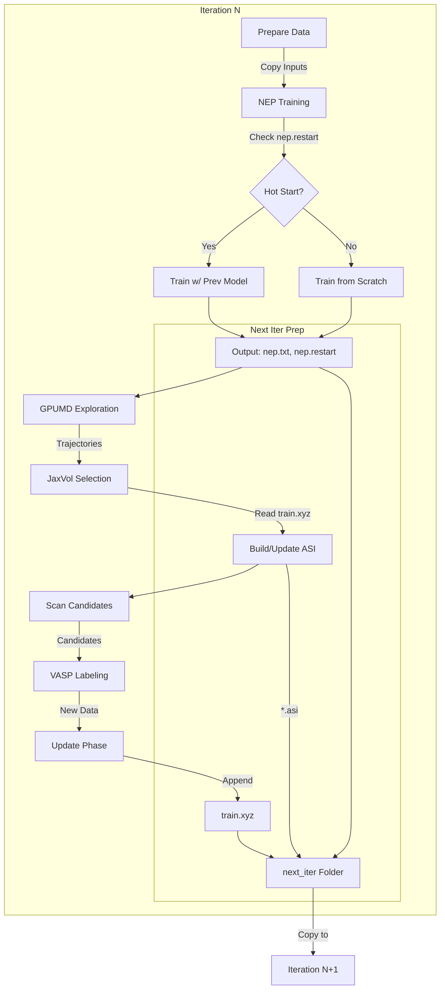

# LearnEP Framework Walkthrough

`learnep` is a new active learning framework designed for NEP potentials, featuring deep integration with `jaxvol` for adaptive sampling and robust iteration control.

## 1. Quick Start

### 1.1 Initialize Configuration
Generate a template `config.yaml` with all available options.
```bash
python -m learnep init --output config.yaml
```

### 2. Verification
To verify the installation and logic without submitting real jobs:
```bash
python tests/run_tests.py
```
This runs a mock suite covering:
- **Cold Start**: Verifies initial training logic.
- **Long Run (10 iters)**: Verifies stability and data flow (Hot Start).
- **Restart**: Verifies resumption capabilities (File cleanup & status reset).

**Verification Status**: All tests passed (Cold Start, Long Run, Restart Logic, VASP/NEP/GPUMD integrations).

**Outputs**:
- Logs: `tests/test_run.log`
- Artifacts: `tests/debug_workspace/<test_name>/` (e.g., `test_cold_start`, `test_long_run`)
  - Inspect `iter_00X` folders here to validate file generation.

### 3. Restart Capability (`--restart-from`)
**Feature**: Restart the workflow from a specific iteration, automatically clearing subsequent progress.

```bash
python -m learnep run config.yaml --restart-from 5
```
**Behavior**:
- Deletes `iter_005` and all subsequent directories.
- Resets `status.json` to mark `iter_004` as the last completed step.
- Resumes execution from Iteration 5.

### 4. Cold vs. Hot Start Logic
**Strict Check**: To perform a "Hot Start" (continuing training from previous model), **BOTH** `nep.txt` and `nep.restart` must be present.
- **Cold Start**: If `nep.restart` is missing (e.g., first run), the system falls back to `first_train_input` (or `train_input`) parameters for a fresh training session.
- **Hot Start (Optimized)**: If both files exist at the start of Iteration 0, the system **skips the initial training step** and uses the provided model immediately for exploration. In subsequent iterations (Iter N > 0), it performs fine-tuning normally using the cumulative dataset.

### 5. Job Monitoring (Dual Check)
Edit `config.yaml` to match your HPC environment (PBS) and simulation parameters.
- **Global**: Set `work_dir` and `scheduler` commands.
- **NEP/GPUMD/VASP**: Define templates.
- **Selection**: Configure `jaxvol` gamma thresholds.


### 6. Workflow Logic
The following flowchart illustrates the strict data flow handled by the Orchestrator:




### 7. File Preparation Matrix
For advanced users, here is the exact file breakdown prepared for each task:

| Task | Input Files Prepared | Generated/Expected Output |
| :--- | :--- | :--- |
| **1. NEP Train** | `nep.in` (from config)<br>`train.sh` (job script)<br>`train.xyz` (data)<br>`nep.restart` (if hot start) | `nep.txt` (model)<br>`nep.restart` (state) |
| **2. GPUMD Explore** | `run.in` (from config)<br>`run.sh` (job script)<br>`model.xyz` (structure)<br>`nep.txt` (force field) | `dump.xyz` / `movie.xyz`<br>(Trajectories) |
| **3. JaxVol Select** | `train.xyz` (for ASI basis)<br>`nep.txt` (descriptors)<br>`active_set.asi` (state) | `active_set.asi` (updated)<br>`candidates.xyz` (structures) |
| **4. VASP Label** | `POSCAR` (candidate)<br>`vasp.sh` (job script)<br>`INCAR`, `POTCAR`, `KPOINTS` | `vasprun.xml` / `OUTCAR`<br>(Energy/Forces) |
| **5. Next Iter** | `nep.txt`, `nep.restart`<br>`active_set.asi`<br>`train.xyz` | *Ready for Iter N+1* |

### 8. Configure
Edit `config.yaml` to match your HPC environment (PBS) and simulation parameters.
- **Global**: Set `work_dir` and `scheduler` commands.
- **NEP/GPUMD/VASP**: Define templates.
- **Selection**: Configure `jaxvol` gamma thresholds.

### 7. Run
Start the active learning loop.
```bash
python -m learnep run config.yaml
```

### Check Status
```bash
python -m learnep status
```

## 2. Key Features

### Iteration Control
You can override parameters for specific iterations using the `iteration_control` block.
```yaml
iteration_control:
  enabled: true
  rules:
    - iterations: [0, 1, 2] # Fast initial exploration
      gpumd:
        conditions: ... # shorter run
```

### Data Flow (`next_iter`)
The framework enforces a strict data flow:
`iter_N` outputs -> `iter_N/next_iter/` -> `iter_{N+1}` inputs.
This ensures reproducibility and clean separation of cycles.

### JaxVol Integration
Candidate selection happens in-process using JAX-accelerated scanning:
- **Adaptive Mode**: Automatically handles Rank-Deficient (QR) -> Full-Rank (MaxVol) transition.
- **Auto-Stop**: QR scanning stops early if gamma distribution stabilizes.
- **Explosion Safety**: Scanning aborts if gamma exceeds `threshold_max`.

### Scheduler Robustness
- **Dual Check**: Jobs are considered done if `DONE` file exists OR if they disappear from the queue.
- **Batch Timeout**: If a batch of VASP jobs exceeds `timeout`, the entire batch is cancelled (`qdel`), allowing the workflow to proceed/fail gracefully.
